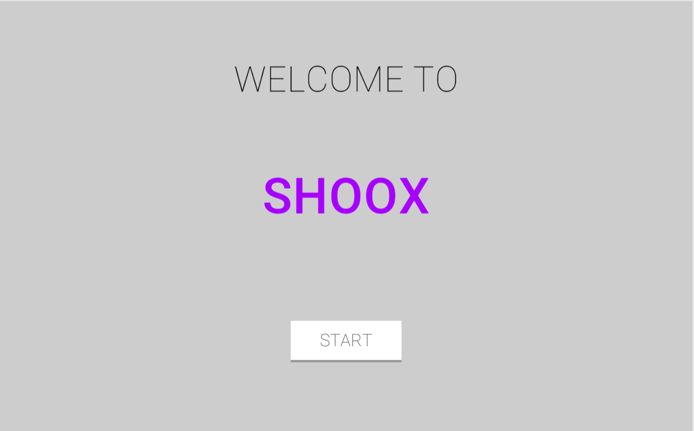
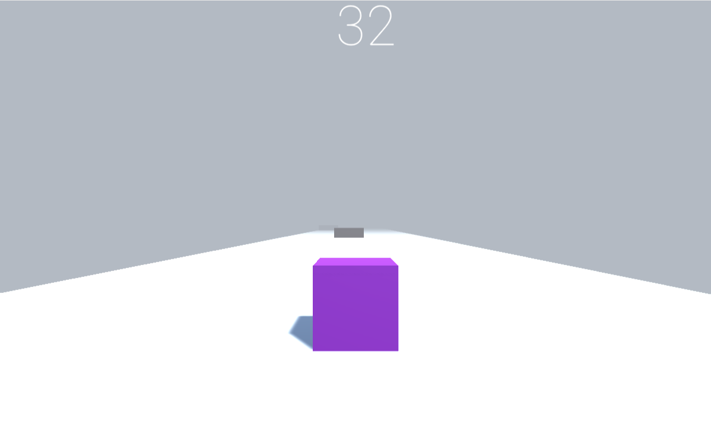

# Shoox - Unity Game

## Play the Game
You can play the game [here](https://raushan27.itch.io/shoox).

## Description
Shoox is an exciting cube game developed in Unity where players navigate through a series of obstacles, testing their reflexes and agility. The game features minimalist graphics and intuitive controls, providing an engaging and challenging experience for players of all ages.

## Features
- Simple yet addictive gameplay
- Minimalist visuals for a clean aesthetic
- Increasingly challenging levels with various obstacles to dodge
- Responsive controls for precise movement

## Installation
1. Clone the repository to your local machine.
2. Open the project in Unity.
3. Navigate to the main scene.
4. Press the play button to start the game.

## Controls
- Use the AD keys to move the cube left or right.

## Gameplay
- Dodge obstacles by moving the cube left or right.
- Reach the end of Level.

## Screenshots

## Credits
- Developed by [Raushan]

## License
This project is licensed under the [MIT License](LICENSE). Feel free to use and modify the code for personal and educational purposes. Commercial use requires attribution.

